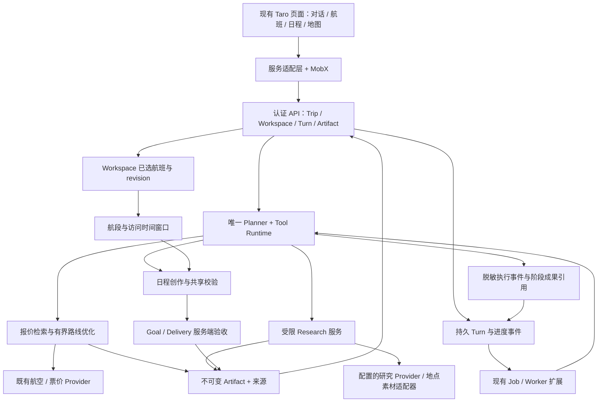

# RDS：在现有 FlightOR 上补齐航班到旅行的闭环

日期：2026-09-20。状态：拟议设计。基线：main `9954c34`；权威顺序遵循 [docs 索引](../../README.md)。跨域变更见 [拟议 ADR 0018](../../adr/0018-budget-travel-agent-evolution.md)，尚未替换已接受契约。

> 本页是后续能力全景，不是本轮全部施工清单。当前修改以 [RUNTIME_PLAN](RUNTIME_PLAN.md) 和 [DPS](DPS.md) 为准：现有 runtime 精简并跑通，再测量/案例评估。完整持久任务、visits v2、地图供应商和多城引擎后置。

## 1. 当前事实与缺口

以下为本轮源码检查；历史真实运行证据引用 [9 月 14 日验收](../../FLIGHT_FIRST_ACCEPTANCE.md)，本轮未重跑 Provider 或真机。

| 能力 | 已有实现与入口 | 本轮判断 |
| --- | --- | --- |
| 唯一 Planner | `backend/src/app.ts` 注册 `routes/agent-cloud.ts`；`agent/cloud/service.ts` → `agent/runtime/runtime.ts` | 保留自主工具编排与 Goal 完成校验；不另加一个总调度 Agent |
| 航班比较 | `fares/search-service.ts`、`agent/tools/flexible-flights.ts`、`flight-routing/optimizer.ts` | 复用；真实 11 个报价到采用已有历史证据，但不能据此宣称已覆盖最低总旅行成本 |
| 已选航班 | `workspaces/flight-selection.ts`、`workspaces/postgres.ts`；`src/features/ui-experience/FlightDecisionPanel.tsx` | offer/route 选择与 revision、服务端恢复已存在；无需另造 selectedFlight 状态 |
| 中转窗口 | `workspaces/flight-selection.ts::layoverWindowsForSegments` | 当前扣除固定 90+180 分钟、至少 480 分钟等粗粒度条件；没有完整的机场到活动交通可行性计算 |
| 日程与校验 | `travel-guides/authored.ts`、`validation.ts`、`agent/goals/travel-guide-verifier.ts` | 绑定航班来源已存在；时间以早午晚为主，最终目的地到达前有活动会被拒绝，`stopover_only` 也进入整日城市排除判断，需要细分访问角色才能承载合法中转活动 |
| 研究 | `routes/agent-cloud.ts`、`research-agent/production.ts`、`native.ts`、ADR 0016 | 已有可配置 Research 实现；最近航班闭环记录中研究两次保存、攻略为零，另有一次研究限流。根因需定位，不能直接归因于模型能力 |
| 进度 | `agent/cloud/turns.ts`、`src/services/conversationService.ts`、`PlannerProgress.tsx` | 现有短轮询及真实阶段；Map 内存存储，进程重启不能恢复临时 turn，不适合直接扩成多实例可靠任务 |
| 偏好 | `trips/types.ts`、`memory/` | 兴趣/预算/节奏/中转偏好可复用；人数、行李等缺少统一 Trip 结构化约束，报价 query 的人数不能替代全程个人条件 |
| 正式 UI | `src/pages/plan/index.tsx`、`src/pages/route/index.tsx`、`productionTripService.ts`、`productionPresentation.ts` | 已有真实接入；转换器活动 latitude/longitude/media 当前为 null，不能将样例图文当作生产事实 |

旧 9 月 13 日交接写“未合并主仓”，不能据此判断今天 main 的能力。当前源码及较新的 flight-first 记录优先用于现状判断。已有测试通过数仅是历史记录。

## 2. 目标架构与职责

采用现有模块化后端加 Worker，不拆微服务。Planner 决定查什么、何时研究、如何表达取舍；领域服务保证报价、时间、选择、版本和完成事实。下图表示依赖与数据流，不是必须执行的固定工具流程。

继续分开 Memory、Conversation、Trip Context、Artifacts；Goal/Run 为执行与交付账本，Workspace selection 为用户选择。进度事件属于运行元数据，不写入对话或 Memory，不作为下一轮模型事实。

## 3. 低价决策：先筛出值得规划的航空骨架（R01–R03）

1. Planner 提取日期弹性、预算范围、目的地开放程度等；领域层解析可信机场身份。先补齐会改变搜索的条件，不为展示完整档案反复追问。
2. 复用 fare search/flexible search；明确同城机场与可替代城市的区别。先小范围得到可用结果，再扩日期或中转城市。底层并行只限相互独立的只读请求，Artifact 写入遵循现有串行/事务边界。
3. 有界搜索采用拓扑裁剪→候选路径→短名单真实报价；预算/次数/日期覆盖均记录，停止扩展时告知覆盖不完整。不要对所有城市、日期和航段笛卡尔积查价。
4. 硬约束先过滤，再保留价格、耗时、折腾程度、可玩时间的 Pareto 候选；优先给最低机票、少折腾、值得停留三个不同代表。兴趣理由由 Agent 基于可核实活动说明，价格排序由服务计算。
5. 扩展报价比较投影 `costBreakdown`：票价、已知行李、必要机场交通、必要过夜住宿分别记录 confirmed/estimated/unknown、币种和查询时间。未知不能当零；只有可比的同口径成本才能标“更省”。示例“机票省 300，但多住一晚估计增加 400”中的估计必须显式标记。
6. 搜索范围与总预算同屏解释；人数/舱位/行李条件一致才计算节省。新增汇率能力前不跨币种直接排序。
7. 用户采用后冻结现有 selection 引用，非锁价。更换日期或报价触发兼容性检查；临近使用时通过已有确认能力刷新，新增确认结果不覆盖旧报价。

不要求所有请求都先研究景点再查价。可以为少数候选中转城市获取轻量兴趣信息，最终详细研究只覆盖采用的路线，减少无效等待。

## 4. 中转是独立访问窗口（R04、R09）

新增领域模块 `backend/src/travel-windows/`（拟建），从服务端已选全部航段计算窗口。保持 flight-selection 为选择权威，将时间可行性计算从固定阈值中提取出来。

拟议 `TravelWindow`：`id / role(destination|stopover|airport) / locationId / arrivalSegmentRef / departureSegmentRef / startInstant / endInstant / timeZone / availableMinutes / buffers / assumptions / feasibility / evidenceRefs / selectionRevision`。时间缺失用未知状态，不填造 UTC；另保留供应商当地时间与时区可信度。

城市可玩时间 = 下一班起飞 − 前班落地 − 下机/入境/取行李 − 进城交通 − 返机场交通 − 值机安检登机预留 − 风险余量。缓冲来自版本化策略与已知机场/票务条件；估计展示区间。未知关键条件时仅给条件方案，同时保留机场内替代。

必须覆盖单个报价内部转机和组合路径不同 edge 之间的等待；当前 routeLayoverWindows 逐 edge 处理，跨 edge 间隙应专门回归。区分联程、拆票、自行取行李、换机场、多日 stopover；能讨论城市不意味着能入境。

攻略 v2 引入每天的多个 `visits[]`，每个 visit 指向 `travelWindowId` 与角色，活动属于 visit。允许同一天“中转城市上午 + 目的地晚上”，不再假设一天只属于一个城市。每项活动可携带建议起止、预计耗时、移动耗时、地点与核验状态。

共享校验器同时用于保存前与最终交付：活动在对应城市访问窗口内；时间不重叠；移动及返场缓冲足够；关闭/未知营业状态区分；到达前不能安排目的地活动，但可安排合法中转活动；`avoid` 禁止经过/访问的含义按明确约束处理，`stopover_only` 允许窗口内中转活动、不能当最终目的地。未知时间不能被默认为通过可执行性验收。

## 5. 个性化与局部修改（R05、R08）

保留“当前明确要求 > Trip > 用户 Memory > 默认值”。拟增加 Trip 的 `party`、`baggage`、`mobilityPreferences`、`maxTransfers`、`maxExtraTravelHours` 等稀疏字段；旅行证件/入境资格只收集做当前判断必要的声明，不保存证件号码，也不默认写长期 Memory。

区分硬约束（预算上限、排除地区、不能夜行等）与软偏好（美食/摄影/慢节奏）。推荐解释引用具体偏好与活动事实，例如“首日下午只安排一处，因为晚间到达且你希望慢节奏”。不得为证明个性化重复用户所有档案。

修改按影响范围使结果失效：兴趣变化可重排活动；日期/机场变化必须重新评估报价与窗口；人数/舱位/行李变化也参与已选报价兼容检查。研究缓存可复用来源，但新 Artifact 必须重新验证适用日期、版本和 owner，不直接复制版本号绕过校验。精细复用是受测兼容策略，不是无限跨版本放行。

## 6. 快速反馈与可恢复任务（R06、R09）

先复用短轮询，暂不为了流式动画更换传输。把现有临时 turn 升级为共享持久任务，继续调用同一 CloudPlannerService；不新增第二套 Agent 业务实现。

- 拟扩展 `POST /v1/agent/turns` 接收客户端幂等键；持久化消息与提交指纹后返回 turnId。相同键不同正文返回冲突。接单响应丢失时按键查询，不重复收费运行。
- 拟扩展 `GET /v1/agent/turns/:turnId?afterSeq=…` 返回快照与有限事件；新增 `DELETE` 取消。Workspace 可发现该会话未终结 turn，刷新/后台回来后恢复。
- `TurnEvent`：`turnId / seq / occurredAt / kind / stage / safeSummary / artifactRefs / completedCount? / totalCount?`。只记录真实事件；可展示“已比较 6 个日期，2 个日期查询失败”，不展示内部推理、完整工具参数和密钥。
- `heartbeat` 与 `lastProgressAt` 分开；网络断开显示最后确认状态，不能假装后台仍在运行。无进展时告知等待来源，不造百分比。
- 拟议状态：queued/running/cancelling/completed/failed/cancelled；业务结果另用 delivery。Worker 采用 lease、heartbeat、fencing token 防止重复执行和迟到写入。外部调用不能保证 exactly-once，记录 attempt 和成本不确定性，崩溃后先恢复已保存产物，再由新执行代续作。
- 阶段成果只引用已落盘 Artifact；攻略未完成时显示可核验的航班/研究结果。逐日草稿需显式 draft 语义，不能把“已显示第一天”当成整份 Goal 完成。
- 减少等待靠复用证据、限制研究范围、紧凑模型上下文、合理只读并行和先交付可用部分。Provider 超时/429 给可重试状态与冷却信息，禁止无界重试。继续保留既有原生研究预算审计。

执行事件示例：“正在比较 10 月 2–5 日航班” → “已找到 8 个候选，另有 1 天待查询” → “已采用经某城市中转的方案” → “中转时间不足，按机场休息安排” → “目的地第 1 天已保存”。每条均须有服务端事实支持。

## 7. 现有 UI 接入与图文地图（R07）

保留 `PlannerPage / FlightDecisionPanel / TripExperience / DayPlan` 的视觉结构，通过 `productionPresentation.ts` 做纯展示转换。服务端负责事实与约束，转换器不拼假航班、不造推荐分数。

| 现有区域 | 接入行为 |
| --- | --- |
| 对话区 | 当前阶段、最近可靠状态、阶段成果卡、取消/恢复；输入不被长任务永久锁死，修改进入明确新版本 |
| 航班面板 | 三类代表、比较口径、附加成本与覆盖范围、采用状态；保留完整航段 |
| 行程详情 | 航班固定摘要、每日 visit、活动理由、中转倒计时边界与待确认事项 |
| 地图与时间轴 | 共用 activity/visit ID；跨国航线是示意，城市活动使用景点级坐标，交通线需真实路线数据或明确示意 |
| 图文卡 | 来源图片与署名/使用信息、加载失败占位、已核验/估计/未知标签 |

拟建地点/素材适配层，Research finding 可引用 `placeId`，地点实体保存经纬度、坐标系、来源、查询时间及有效性；图片保存来源、可用 URL 与使用信息。不从城市中心坐标制造景点位置。前端边界按运行平台处理地图坐标，避免重复转换；地图供应商尚未选定，接入前用目标城市与真机验证覆盖、域名及素材条件，不在本提案中承诺某 Provider 可用。

## 8. 兼容、围栏与运行质量

| 边界 | 规则 |
| --- | --- |
| 允许 | 在现有 Trip、Fare、Workspace、Research、Guide、Goal、Turn 职责内扩展；现有页面逻辑接入 |
| 禁止 | 重写蓝色 UI、恢复 regex 主解释器、合并四类状态、伪造报价/图片/坐标、降低 verifier 掩盖失败、修改无关 demo 或密钥 |
| 条件修改 | 攻略 v2、持久 Turn 数据表、公开工具、往返/多城引擎扩展：先完善 ADR、迁移与测试，再实现 |

攻略 v1 保持可读，v2 新写使用 schema 分派；旧数据缺地点或分钟级时间只能显示原有精度。先部署兼容 reader，再启用 v2 writer；功能开关关闭时保留已产生 v2 的 reader。新表采用增量迁移，取消/并发/owner 校验沿用 Workspace 事务入口。

关键指标：接单、首次成果、全程完成时间，研究到攻略转化率，失败原因，Provider 429/延迟，取消生效延迟，过期写入拒绝数，地图坐标覆盖率与成本。日志只保留脱敏 ID/计数，不记录私人 Memory 或完整旅行身份信息。

验证区分：领域单测、数据库并发、严格快照回放、真实 Provider、微信开发者工具、真机。已有 H5 成功不能替代后两项。新增能力的发布以 [DPS](DPS.md) 各阶段出口为准。
